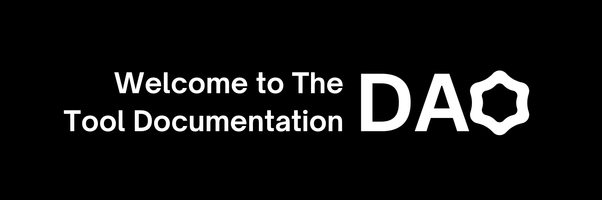

# Welcome to The DAO Tool Documentation

Hey there! I’m **Kartik Mehta**, the creator of **The DAO Tool** — and I’m genuinely excited to have you here.

This guide is designed to help you get the most out of the platform, whether you’re:

- Setting up your local environment.  
- Integrating GitHub or Discord.  
- Exploring the backend architecture.  
- Customizing your own DAO workflows.  
- Using the REST API to extend the platform.  

The DAO Tool is open-source, modular, and built with love for async, decentralized teams. Whether you're running a DAO, an open-source project, or just experimenting — **this doc is your map**.

👉 Please stick around, explore the sections, and don’t hesitate to fork, build, and contribute.

I’m available if you’d like to chat or discuss anything — feel free to reach out via [Website](https://www.mrmehta.in), [X](https://x.com/kartik_mehta8), [Calendly](https://calendly.com/kartikmehta/15min), or [GitHub](https://github.com/kartikmehta8).

Thanks for checking it out — and seriously, welcome aboard. Let’s make decentralized work more accessible, one bounty at a time.  
