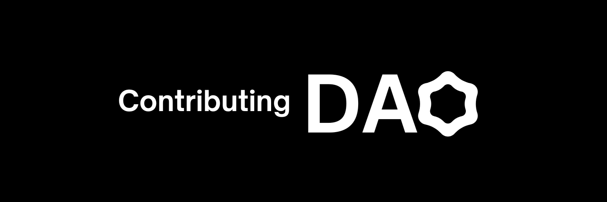

# Contribution Guidelines

Thank you for your interest in contributing to The DAO Tool! We appreciate your time and effort in helping improve this project. Please take a moment to review these guidelines before making contributions.

## Code of Conduct

All contributors must adhere to our [Code of Conduct](./code-of-conduct.md). By participating, you are expected to uphold this code.

## Getting Started

1. **Fork** the repository on GitHub
2. **Clone** your forked repository to your local machine
3. Create a new **feature branch** for your changes
4. Make your changes following our coding standards
5. **Test** your changes thoroughly
6. **Commit** your changes with clear, descriptive messages
7. **Push** your changes to your fork
8. Open a **Pull Request** against the main repository

## How to Contribute

### Reporting Issues
When submitting bug reports:
- Check existing issues to avoid duplicates
- Use a clear, descriptive title
- Include steps to reproduce the issue
- Specify expected vs. actual behavior
- Provide environment

### Feature Requests
For new feature suggestions:
- Explain the problem it would solve
- Provide use cases and context
- Outline potential implementation approaches
- Reference similar features in other projects if applicable

### Pull Requests
To submit code contributions:
- Keep PRs focused on a single feature/bug/fix
- Reference related issues in your description
- Include tests for new functionality
- Update documentation as needed
- Follow our coding style guidelines

## Code Quality Standards

- Maintain consistent style with existing code
- Write clear, self-documenting code
- Include appropriate comments for complex logic
- Keep commits atomic and well-described
- Ensure all tests pass before submitting

## Review Process

- All PRs will be reviewed by maintainers
- Reviewers may request changes or clarification
- Be responsive to feedback on your PR
- PRs must pass CI checks before merging
- Maintainers reserve the right to reject contributions that don't align with project goals

## Need Help?

If you have questions about contributing:
- Search existing issues and documentation first
- Open a new issue for clarification
- Reach out to maintainers through designated channels

We appreciate your contributions and look forward to collaborating with you!
