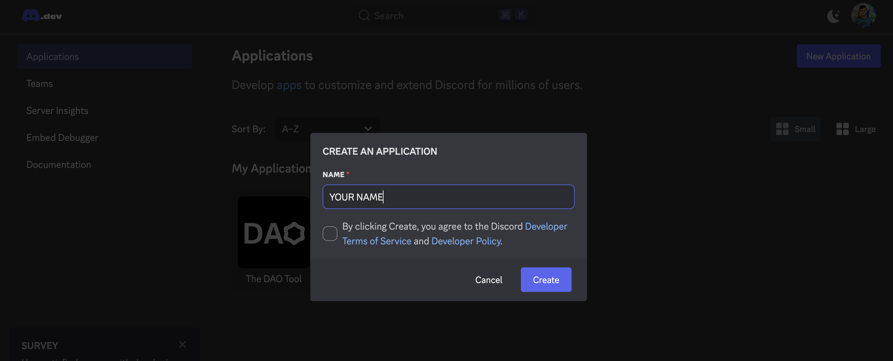
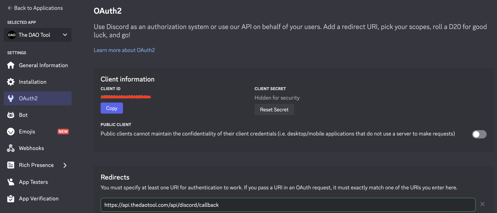
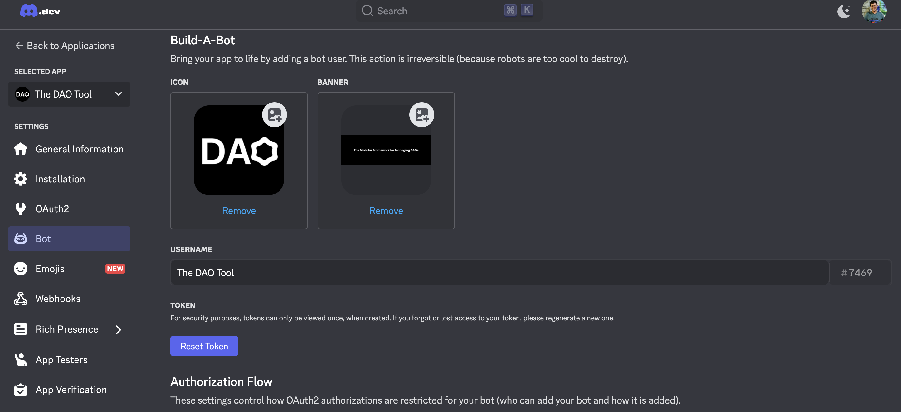

# Discord

This section will walk you through how to set up Discord integration so your DAO Tool instance can auto-post bounties into your server channels.


## 1. Create a Discord Application



Head to the [Discord Developer Portal](https://discord.com/developers/applications) and click **"New Application"**.

- Give your app a name.
- Click **Create**

Once the app is created, you’ll land on the app dashboard.

## 2. Configure OAuth2



Navigate to the **OAuth2** tab on the left sidebar.

- Under **Redirects**, add the following:
  ```
  http://localhost:5050/api/discord/callback (Or use your deployed Discord callback URI.)
  ```
  > This must match exactly with the backend environment variable and must be registered before testing the integration.

- Scroll down and click **"Save Changes"**

Now, from the **OAuth2 → General** section:

- Copy the **Client ID**
- Click **"Reset Secret"** or **"Copy Secret"** to get the **Client Secret**

Add these to your `/server/.env` file:

```env
DISCORD_CLIENT_ID=your-client-id
DISCORD_CLIENT_SECRET=your-client-secret
```

## 3. Set Up the Bot



Now go to the **Bot** tab in the sidebar.

- Upload a bot icon. (optional but recommended)
- Give your bot a meaningful username.
- Enable **Public Bot** if it's not already checked.
- Scroll down and click **"Copy Token"**

Add it to your `/server/.env`:

```env
DISCORD_BOT_TOKEN=your-bot-token
```

That’s it! Your bot is ready to start sending updates — users will authorize it from their profile page directly.
