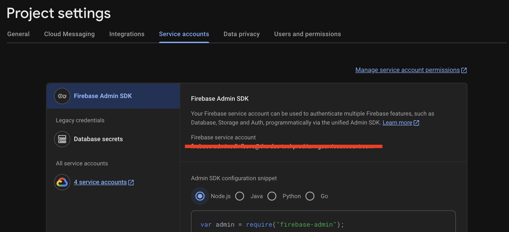
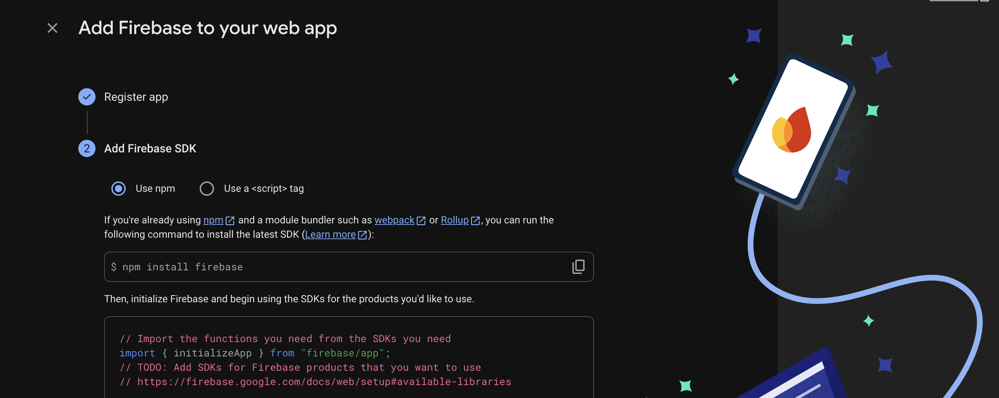

# Firebase

This section will help you connect Firebase to your local server for real-time communication and data storing.


## 1. Create a Firebase Project

Go to [Firebase Console](https://console.firebase.google.com/) and create a new project. Once it’s created, you’ll get access to:

* Realtime Database URL
* Storage Bucket (Although we don't need it right now, it's good to have.)
* Service Account Credentials


## 2. Enable Realtime Database & Set Rules

* Navigate to **Build → Realtime Database → Create Database**
* Choose a location of your choice (or nearest to your location).
* Create a database in **test mode**
* Paste the following rules in the `Rules` tab:

```json
{
  "rules": {
    ".read": true,
    ".write": true
  }
}
```

This allows open read/write during development.


Make sure to restrict access for production.


## 3. Generate a Service Account



* Go to **Project Settings → Service Accounts**
* Click **Generate new private key**
* Save the file as:

```
/server/firebase.json
```

This file will be used to authenticate server-side actions.

## 4. Add Required Firebase Environment Variables

After creating your Firebase project, make sure to **register a Web App** from the Firebase Console:



* Go to **Project Settings → General → Your Apps**
* Click **Add App → Web App** and register your app with a name.
* Once done, you'll get the configuration details like `projectId`, `databaseURL`, and `storageBucket`

Now in your `.env` file (inside the `/server` directory), add the following:

```env
FB_REALTIME_DATABASE=
FB_STORAGE_BUCKET=
```

That’s it! Your Firebase backend is now ready to power The DAO Tool’s real-time features. Now, let’s move on to setting up **GitHub**.
