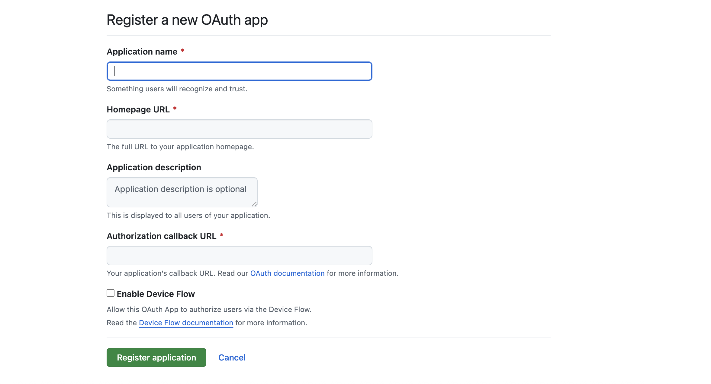

# GitHub

This section will help you integrate GitHub into your local server so that issues labeled `dao` from connected repositories can be synced as bounties.


## 1. Create a GitHub OAuth App

Go to [GitHub Developer Settings](https://github.com/settings/developers) and create a new **OAuth App**.



* Application Name: `GIVE IT A NAME`
* Homepage URL: `http://localhost:3000` (Or use your deployed frontend URI.)
* Authorisation Callback URL: `http://localhost:5050/api/github/callback` (Or use your deployed GitHub callback URI.)

## 2. Get Client ID & Secret


After creating the app:

* You'll get the **Client ID**
* Click "Generate a new client secret" to get the **Client Secret**

Copy these values and add them to your `.env` file inside the `/server` directory:

```env
GITHUB_CLIENT_ID=your-client-id
GITHUB_CLIENT_SECRET=your-client-secret
```

These credentials will be used to authenticate users and sync GitHub issues automatically via background workers.

## 3. Authorise from the Platform

Once the app is running locally:

* Go to `https://app.thedaotool.com/profile/organization` or `https://app.thedaotool.com/profile/contributor`.
* Click “Authorize GitHub”.
* This will redirect you through the OAuth flow, store tokens securely, and begin syncing your repository issues (labeled `dao`) to the bounty board.

That’s it! GitHub is now successfully connected to your local environment.

Let’s move on to setting up **Discord** next!
