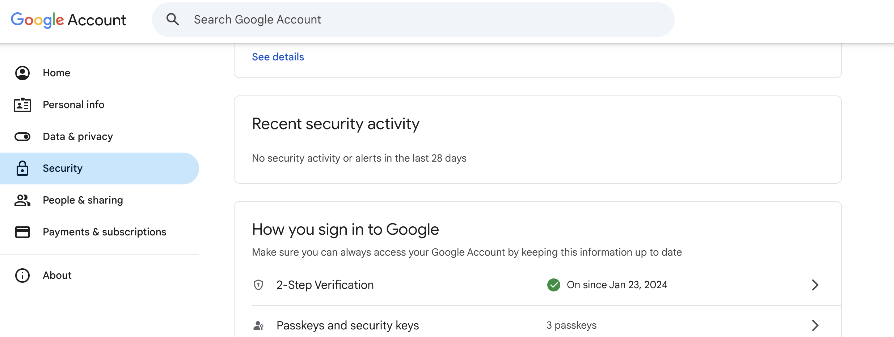
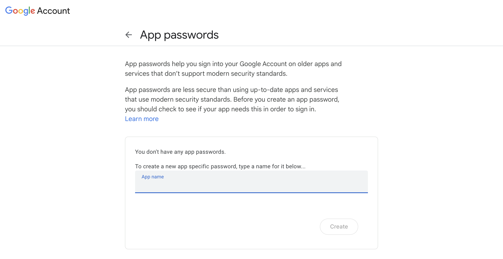

# Mail Setup

This section will help you set up email functionality in The DAO Tool — used to send notifications like bounty assignments, password resets, and email validation.


We’ll be using **Gmail's SMTP service** to send emails securely.

## Step 1: Enable 2-Step Verification (if not already)



First, make sure 2-Step Verification is enabled on your Google account.  
You can enable it here: [myaccount.google.com/security](https://myaccount.google.com/security)

## Step 2: Create an App Password



1. Go to your [Google App Passwords](https://myaccount.google.com/apppasswords) page.
2. Please provide a valid name for your application.
3. Click **Create**.  
   Google will give you a **16-character app password** (looks like `abcd efgh ijkl mnop`).

## Step 3: Add to `.env` File

Now open your `/server/.env` file and add the following:

```env
SMTP_USER=your-gmail-address@gmail.com
SMTP_PASS=your-16-character-app-password
```

> Make sure your Gmail is a trusted sender (ideally not your personal account) for better deliverability on production.

That’s it! Your emails will now be sent using your Gmail account via secure SMTP.
