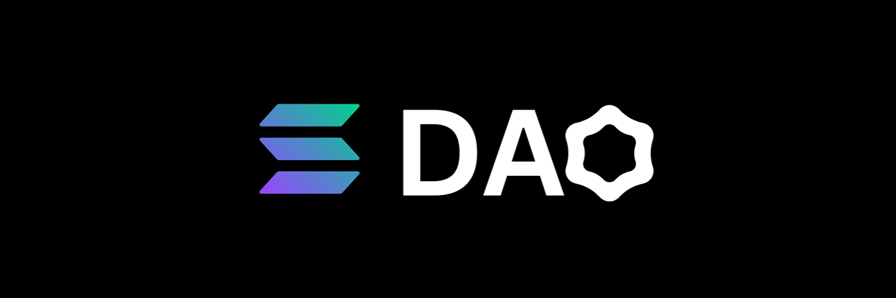
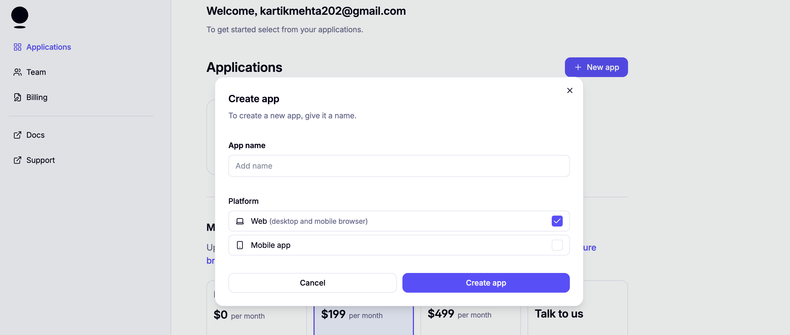
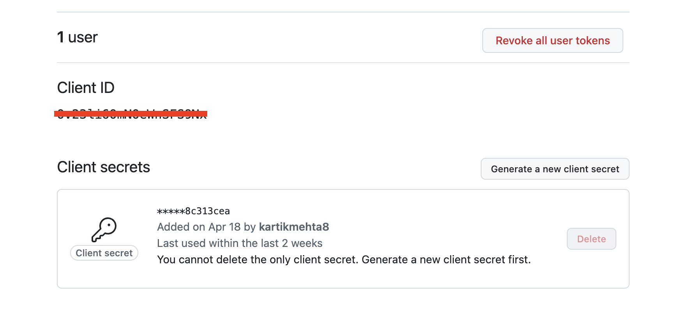

# Privy

This section will guide you through setting up **Privy authentication** and configuring **Solana environment variables** for The DAO Tool.

Privy handles secure wallet creation, which is attached to your account upon sign-up, while the Solana variables allow you to connect to your preferred RPC endpoint for on-chain operations.



## 1. Set Up Privy



Head to the [Privy Dashboard](https://dashboard.privy.io/) and follow these steps:

- Click **"Create App"**
- Select **"Web"** as the platform
- Once created, you'll get:
  - **Privy App ID**
  - **Privy App Secret**

You can also find these under **App Settings → Basic** section later.



For more, check out [Privy Docs](https://docs.privy.io/) to explore available auth flows and configuration options.

Add these to your `/server/.env` file:

```env
PRIVY_APP_ID=your-app-id
PRIVY_APP_SECRET=your-app-secret
```

## 2. Configure Solana Environment

To connect to the Solana network and perform wallet-based payouts, you need two key values.

### `SOLANA_CAIP2`

This is a **chain ID** used for CAIP-2-compatible blockchain identification.  
For Solana Mainnet, use:

```env
SOLANA_CAIP2=solana:mainnet
```

For Devnet, use:

```env
SOLANA_CAIP2=solana:devnet
```

Read more about CAIP-2: [Chain Agnostic Improvement Proposals](https://github.com/ChainAgnostic/CAIPs/blob/master/CAIPs/caip-2.md)

### `SOLANA_RPC_URL`

This is your **RPC endpoint** to send transactions and fetch account data.  
You can use the public RPC or a private one (recommended for scale). Example:

```env
SOLANA_RPC_URL=https://api.mainnet-beta.solana.com
```

You may also use providers like [QuickNode](https://www.quicknode.com/), [Alchemy](https://www.alchemy.com/), or [Helius](https://www.helius.xyz/) for improved speed and reliability.

That’s it! You’re all set to integrate Privy auth and connect your app to the Solana network.
